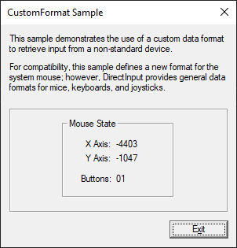
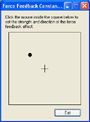
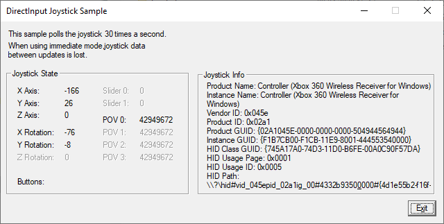

# DirectInput Samples

[https://github.com/walbourn/directx-sdk-samples](https://github.com/walbourn/directx-sdk-samples)

This is the DirectX SDK's Direct3D 11 sample updated to use Visual Studio 2012 and the Windows SDK 8.0 without any dependencies on legacy DirectX SDK content. This sample is a Win32 desktop DirectX 11.0 application for Windows 10, Windows 8.1, Windows 8, Windows 7, and Windows Vista Service Pack 2 with the DirectX 11.0 runtime. 

**This is based on the legacy DirectX SDK (June 2010) Win32 desktop sample. This is not intended for use with Windows Store apps, Windows RT, or universal Windows apps.**

The DirectInput API is not available for Windows Store apps or on Windows RT (aka Windows on ARM). The Xbox 360 Common Controller and the XINPUT API is the recommended solution for modern game controllers and is supported on these platforms.

The DirectInput API is not recommended for use for traditional mouse and keyboard data, and use of standard Win32 messages is preferred. This is why the older DirectX SDK samples "Keyboard" and "Mouse" are not included in the latest DirectX SDK or this package.

The DirectInput API's remaining utility is for driving HID-only game controllers, haptic devices, and custom force-feedback devices.

Description
===========

CustomFormat
------------

This sample illustrates the use of a custom data format.

**Note:** If your mouse has more than four buttons, not all of the buttons will be used by this sample.

The comments in CustomFormat.cpp explain how to create, initialize, and retrieve data with a custom data format. You might want to use a custom data format for adding support for a non-standard input device. By enumerating the device objects, you can determine exactly what data is available. The data format you create specifies how the data you are interested in will be stored.

For compatibility, this sample creates a new format to store mouse data. Usually, you would want to use one of the provided c\_dfDIMouse types, but the steps taken to create the custom format will be the same for any hardware device. For more information, see IDirectInputDevice8::SetDataFormat.

FFCont
------

The FFConst sample program applies raw forces to a force-feedback input device, illustrating how a simulator-type application can use force feedback to generate forces computed by a physics engine.

You must have a force-feedback device connected to your system in order to run the application.

When you run the application, it displays a window with a crosshair and a black spot in it. Click anywhere within the window's client area to move the black spot. (Note that moving the device itself does not do anything.) FFConst exerts a constant force on the device from the direction of the spot, in proportion to the distance from the crosshair. You can also hold down the mouse button and move the spot continuously.

This sample program enumerates the input devices and acquires the first force-feedback device that it finds. If none are detected, it displays a message and terminates.

When the user moves the black spot, joySetForcesXY function converts the cursor coordinates to a force direction and magnitude. This data is used to modify the parameters of the constant force effect.

Joystick
--------

The Joystick sample program obtains and displays joystick data.

The application polls the joystick for immediate data in response to a timer set inside the dialog procedure.

Building for Windows XP
=======================

The DirectInput legacy API is available on Windows XP, so this sample can be built using Visual Studio 2012 with the Windows XP compatible Platform Toolset "v110\_xp" included with _Visual Studio 2012 Update 1_. Remove the link references to `DXGUID.LIB`. You will need to locally define the required GUIDs by using `#define INITGUID` before including `dinput.h` in one of the modules.

Notes
=====

* These samples use DirectInput8. The DirectInput7 API is not supported for x64 native applications. The Windows 8.0 SDK only includes the DirectInput8 link library (`dinput8.lib`), and DirectInput7 was last supported by the DirectX SDK (August 2007) release.

* The Xbox 360 Common Controller driver exposes a legacy HID device for compatability with older DirectInput only applications. Such a device can be used with the Joystick sample as a result.

* This Xbox One driver for Windows also exposes a legacy HID device that behaves exactly as the Xbox 360 Common Controller driver's HID device support.

* Legacy joysticks using a "gameport" are not supported for Windows Vista, Windows 7, or Windows 8. Only HID-based USB devices are supported.

* The "ActionMapper" functionality was removed from DirectInput as of Windows Vista and is no longer supported.

More Information
================

[DirectX Tool Kit: Now with GamePads](http://blogs.msdn.com/b/chuckw/archive/2014/09/05/directx-tool-kit-now-with-gamepads.aspx)

[Where is the DirectX SDK?](http://blogs.msdn.com/b/chuckw/archive/2012/03/22/where-is-the-directx-sdk.aspx)

[Where is the DirectX SDK (2013 Edition)?](http://blogs.msdn.com/b/chuckw/archive/2013/07/01/where-is-the-directx-sdk-2013-edition.aspx) 

[Games for Windows and DirectX SDK blog](http://blogs.msdn.com/b/chuckw/)